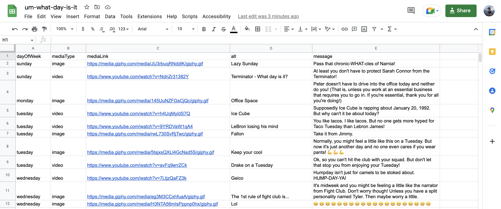
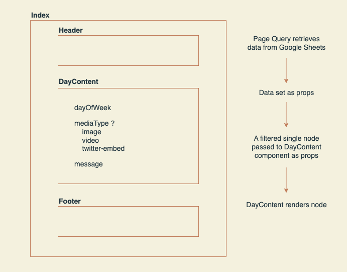

[](https://app.netlify.com/sites/um-what-day-is-it/deploys)

# Um What Day Is It?
Because seriously, what day is it? 🤔

## Introduction
Hello! My name is Levi Porter and I'm a fullstack software engineer.

### Education
- DevLeague - JavaScript & Node.js
- Code Fellows - Java

### Experience
- 1 year as a contractor working for digital agencies
- 3 years as SDE at Amazon Web Services on the Sign-in Team
- Previous experience working in digital marketing
- Served in the US Coast Guard

## Background
In April 2020, I was inspired to build a small, fun project to answer a question that it seemed many people had during the repetitiveness of the pandemic - Um What Day Is It?

### Inspiration
- Covid-19 Pandemic
- Conversations with friends and family
- [This hilarious morning news segment](https://www.youtube.com/watch?v=I36T_BDuZaM)

### Goals
- Move quickly.
- If necessary, ship MVP then build upon it.
- Fast, native-like web experience (especially on mobile devices).
- Simple frontend design.
- Content should be humorous.

### Version 2.0
In August 2022, I revisited the project with the goal of using it as a sandbox to learn new software tools. This new version is built with a backend Django application and utilizes MongoDB as the datastore.

This document will focus on the design of the original version, but you can [learn more about version 2.0 here.](https://github.com/levibrooke/um-what-day-is-it/tree/rest-backend)

## Tech Stack
- Frontend: Gatsby as a React-based static site generator
- Backend: Google Sheets as CMS (Gatsby plugin)
- Hosting: Netlify

### Other Options Considered
- Create React App
- Next.js
- Database + server for API routes

## Data Layer
One of the best features of Gatsby is its ability to load data from anywhere. Some examples include:
- Filesystem
- Headless CMS
- Hosted Services
- Private APIs
- Database

Gatsby has a large library of plugins to help you source data from these sources. After some research, I discovered that there was a plugin specifically for sourcing from Google Sheets. I chose to use this plugin because it would allow me to move quickly and avoid the time it would take to choose and setup a traditional CMS or database option.

### Data Model
The data model is pretty simple. It looks like this:

```json
{
  "dayOfWeek": "sunday",
  "mediaType": "image",
  "mediaLink": "https://media.giphy.com/media/JU3rbuqRNddlK/giphy.gif",
  "alt": "Lazy Sunday",
  "message": "Pass that chronic-WHAT-cles of Narnia!"
}
```

There were two important decisions I made when designing the model. 
1. The application would serve different types of media content.
2. The source for the content would come from existing platforms. 

This meant that I did not have to worry about asset hosting. However, the application would be at the mercy of the platform or content owner for continued availability of the content.

### The CMS
This is what the content looks like in Google Sheets:


### Querying the Data
Gatsby is capable of fetching data at both build time and runtime. Since the data for this project was unlikely to change often, I chose to utilize the source plugin I found which fetches the data at build time.

This is what the page query for data from Google Sheets looks like:

```js
export const query = graphql`
  query {
    allGoogleSheet1Sheet {
      edges {
        node {
          id
          dayOfWeek
          mediaLink
          mediaType
          message
          alt
        }
      }
    }
  }
`;
```

### Updating the Data
Since the application is sourcing the data at build time, I needed a way to trigger a new build if there was a content update. This can be done manually via Netlify's website or CLI tool. But the better solution is to utilize a webhook.

With Google Sheets, you can accomplish this by using the Apps Script extension. Using the extension, I was able to write a script that would send a POST request to the Netlify webhook. And all this is triggered simply by clicking a menu button in my Google Sheet.

## Presentation Layer
Since the goal was to build a simple, native-like web application, there is not much complexity with the frontend. There are three view states that the application can be in:

1. A welcome view
2. A content view 
3. An out of content view

### Component Structure
This diagram describes the structure of the React components and how the Google Sheet data flows:



### Event Methods
1. ComponentDidMount: Use utility function to determine the day and set in state.
2. Show Content View: Pass all Google Sheet data into filter function. Data for the day is set in state, current content is randomly selected.
3. Show New Random Content: Previous content is removed from state. New content is randomly selected from remaining content for the day.
4. Reset: Flip flags to render welcome view.

### Styling
- Color scheme
- Font choices
- Utilized SCSS for all styling
- Responsive

## Opportunities
1. Convert class component into a functional component utilizing React hooks.
2. Test coverage to detect issues such as content availability.

## Questions?
